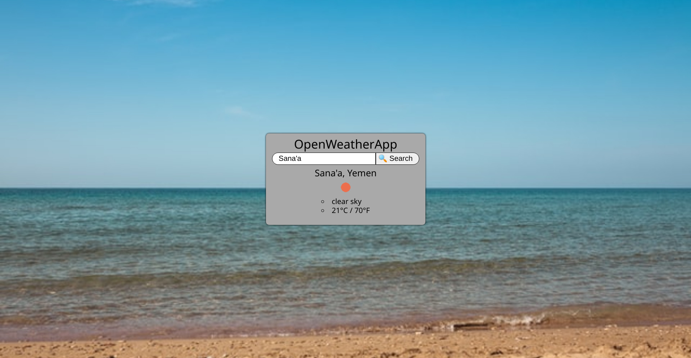

# OpenWeatherApp

Weather web app made as part of [The Odin Project's JavaScript
course](https://www.theodinproject.com/courses/javascript/lessons/weather-app).
Practice for ReactJS and using external APIs.

[Try it out here](https://lukylurks.github.io/weather-app/).

## Structure

- WeatherApp is a container component where most of the state lives, containing:
	* FormAndResults, which contains:
		- WeatherResults: which will either contain the weather info with some
		  state, or instruction and possibly an error message.

- [App.js](./src/App.js) is where the API calls are processed
- [FormAndResults.js](./src/FormAndResults.js) is where the data from App.js is
  sent and being formatted/displayed

## License

[Creative Commons Attribution-ShareAlike 4.0 International licence (CC BY-SA
4.0)](https://creativecommons.org/licenses/by-sa/4.0)
